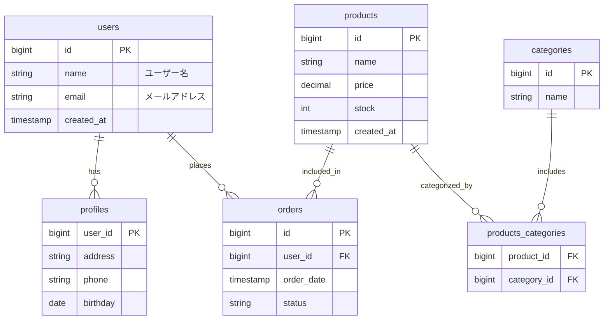

```mermaid
erDiagram
  users {
    bigint id PK
    string name "ユーザー名"
    string email "メールアドレス"
    timestamp created_at
  }

  profiles {
    bigint user_id PK
    string address 
    string phone
    date birthday
  }

  orders {
    bigint id PK
    bigint user_id FK
    timestamp order_date
    string status
  }

  products {
    bigint id PK
    string name
    decimal price
    int stock
    timestamp created_at
  }

  categories {
    bigint id PK
    string name
  }

  products_categories {
    bigint product_id FK
    bigint category_id FK
  }

  %% Relations
  users ||--o{ profiles : has
  users ||--o{ orders : places
  products ||--o{ orders : included_in
  products ||--o{ products_categories : categorized_by
  categories ||--o{ products_categories : includes
```