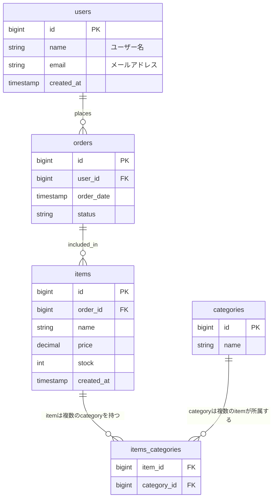

```mermaid
erDiagram
  users {
    bigint id PK
    string name "ユーザー名"
    string email "メールアドレス"
    timestamp created_at
  }

  orders {
    bigint id PK
    bigint user_id FK
    timestamp order_date
    string status
  }

  items {
    bigint id PK
    bigint order_id FK
    string name
    decimal price
    int stock
    timestamp created_at
  }

  categories {
    bigint id PK
    string name
  }

  items_categories {
    bigint item_id FK
    bigint category_id FK
  }

  %% Relations
  users ||--o{ orders : places
  orders ||--o{ items : included_in
  items ||--o{ items_categories : "itemは複数のcategoryを持つ"
  categories ||--o{ items_categories : "categoryは複数のitemが所属する"
```